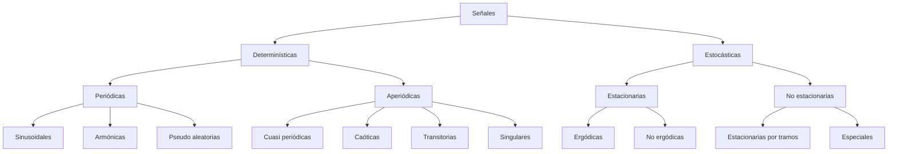

---

> [!quote] Idea central **Señales** que transportan **información** y son transformadas por **sistemas**.

> [!question] Clase _(anotar acá lo que el profesor haya remarcado especialmente de esta clase — ejemplos que dio, qué definiciones pidió memorizar tal cual, etc.)_

---

## 1. Señal y ruido

> [!abstract] **Señal:** proporciona información sobre el estado de un sistema; es la representación física de la información transportada. Se representa como una función, generalmente de la variable tiempo.

> [!abstract] Ruido Mezcla de ondas de diferentes frecuencias y amplitudes que carecen de periodicidad y armonía. Hay tantos tipos de ruido como señales — **no siempre es aleatorio**.

**Ubicación de las fuentes de ruido:**

|Relacionadas con...|Tipo|
|---|---|
|el sistema bajo estudio|intrínsecas · asociadas|
|el sistema de medida|internas · externas|

### 1.1 Relación señal-ruido (S/N o SNR)

Mide cuánto está contaminada una señal por el ruido: $$\xi=\frac{P_s}{P_r}\qquad\text{o en decibeles}\qquad \xi_{dB}=10\log\left(\frac{P_s}{P_r}\right)\ dB$$ donde $P_s$ = potencia de la señal, $P_r$ = potencia del ruido.

---

## 2. Clasificación de señales

> [!tip] Cinco criterios de clasificación Morfológico · Fenomenológico · Energético · Dimensional · Espectral

### 2.1 Criterio morfológico

Según el carácter continuo o discreto de la **amplitud** de la señal:

- Analógicas
- Muestreadas
- Cuantizadas
- Digitales

### 2.2 Criterio fenomenológico

Según si se puede predecir o no la evolución exacta de la señal.

#### Determinísticas

Evolución perfectamente predecible, con valores exactos.

> [!abstract] Periodicidad
> 
> - **Continuo**: $x(t+T)=x(t)\ \ \forall t\in(-\infty,\infty)$
> - **Discreto**: $x(n+N)=x(n)\ \ \forall n\in(-\infty,\infty)$
> 
> El menor valor positivo de $T$ (o $N$) que cumple la ecuación se llama **período** de la señal.

- **Armónicas**: ondas senoidales cuyas frecuencias guardan una relación de números enteros entre sí.
- **Pseudo aleatorias**: parecen aleatorias, pero no lo son.
- La **superposición de ondas armónicas** da una señal periódica; la superposición de ondas **no armónicas** da una forma aperiódica.

**Aperiódicas**, se dividen en:

- Cuasi periódicas
- Caóticas — sensibles a pequeñas perturbaciones, impredecibles
- Transitorias — agotan su energía dentro del período de observación
- Singulares — escalón unitario, rampa unitaria, delta de Dirac

#### Estocásticas

Impredecibles; se describen mediante estadística.

> [!abstract] Estacionariedad y ergodicidad
> 
> - **Estacionarias**: las propiedades estadísticas no dependen del tiempo.
>     - **Ergódicas**: el promedio estadístico a lo largo de la muestra = promedio temporal a lo largo del eje del tiempo, para cualquier función muestra.
>     - **No ergódicas**.
> - **No estacionarias**: estacionarias por tramos (sistemas que varían sus parámetros) o especiales.

> [!warning] Relación clave Ergodicidad $\Rightarrow$ Estacionariedad, pero **Estacionariedad $\nRightarrow$ Ergodicidad** (no es recíproco).

### 2.3 Criterio energético

Según si la señal posee o no **energía finita** y/o **potencia media finita**.

### 2.4 Criterio dimensional

Según el número de variables independientes del modelo de la señal.

### 2.5 Criterio espectral

Según la forma de la distribución de frecuencias: baja frecuencia, alta frecuencia, banda angosta, banda ancha.

---

## 3. Operaciones con señales

### 3.1 Operaciones básicas

- **Operadores binarios**
    - Adición – sustracción
    - Productos: por un escalar · punto a punto · interno / externo
- **Operadores unarios**
    - Operaciones sobre el rango
    - Operaciones sobre el dominio
    - Interpolación y decimación

### 3.2 Operaciones sobre el rango

$$x_{nuevo}(t)=\rho(x_{viejo}(t))$$

- Amplificación
- Rectificación
- Cuantización

### 3.3 Operaciones sobre el dominio

$$x_{nuevo}(t)=x_{viejo}(\tau(t))$$

- Compresión
- Expansión
- Inversión
- Traslación

### 3.4 Interpolación y decimación

> [!abstract] Interpolación Aumenta la frecuencia de muestreo original de una señal de tiempo discreto (en el límite, hasta infinito). $$x(t)=\sum_n x^*(nT)\cdot i!\left(\frac{t-nT}{T}\right)$$

|Tipo|Fórmula|
|---|---|
|Orden 0 (escalón)|$i_{step}(t)=\begin{cases}1 & 0<t<1\0&\text{en otro caso}\end{cases}$|
|Orden 1 (lineal)|$i_{lineal}(t)=\begin{cases}1-\|t\| & \|t\|<1\0&\text{en otro caso}\end{cases}$|
|Ideal (sinc)|$i_{sinc}(t)=\begin{cases}\sin(t)/t & t\neq0\1&t=0\end{cases}$|

- Interpolación lineal
- Interpolación polinómica
- Interpolación sinc

> [!abstract] Decimación (muestreo) Reduce la frecuencia de muestreo original de una señal de tiempo discreto.

---

## 4. Conversión analógico/digital (A/D)

|Etapa|Qué hace|Contras / a tener en cuenta|
|---|---|---|
|**Ventaneo**|Se mide durante un intervalo finito de tiempo|Se pierden cambios rápidos|
|**Muestreo** (uniforme / no uniforme)|Se mide en intervalos prefijados|Se pierden intervalos lentos; depende de la fiabilidad del reloj|
|**Retención**|—|—|
|**Cuantización**|La precisión se limita por el número de bits disponible|Depende del rango dinámico; pueden cometerse errores aritméticos|
|**Codificación**|—|—|

> [!abstract] Función de cuantización $$\rho(x)=\begin{cases}0 & x<0\ H\cdot\text{int}(x/H) & 0<x<(N-1)H\ (N-1)H & x>(N-1)H\end{cases}$$ **Ruido de cuantización**: $\pm\tfrac12$ LSB.

---

## 5. Teoría de la comunicación

> [!abstract] Teoría de la información Se ocupa de la **medición** de la información, su **representación**, y de la **capacidad** de los sistemas de comunicación para transmitirla y procesarla.

> [!abstract] Procesamiento de la señal Basado en los métodos de la teoría de la información y de la señal; se encarga de la elaboración/interpretación de señales que transportan información, con ayuda de la electrónica, la computación y la física aplicada. **Objetivo**: extracción, transmisión o almacenamiento de la información útil contenida en las señales.

### 5.1 Procesamiento Digital de Señales (DSP)

> [!abstract] Definición Modificar o analizar señales representadas como una secuencia discreta de números.

|Ventajas|Desventajas|
|---|---|
|**Versatilidad**: fácil de reprogramar y migrar|Requiere mucha matemática|
|**Repetibilidad**: fácil de duplicar, no varía con la temperatura|Requiere tiempo finito de respuesta|
|**Simplicidad**: algunas cosas son más fáciles en digital que en analógico|Puede necesitar mucho almacenamiento|

**Aplicaciones**: radar, telefonía, audio, sonar, TV digital, multimedia, etc.

---

## 6. Técnicas de procesamiento de señales

|Técnica|Descripción|
|---|---|
|**Amplificación**|Aumentar la amplitud de una señal eléctrica|
|**Análisis**|Aislar componentes de forma compleja para comprender mejor su naturaleza u origen|
|**Modulación**|Variar amplitud, fase o frecuencia de una portadora en función de una señal mensaje/moduladora|
|**Medición**|Estimar el valor de una variable característica de la señal|
|**Filtrado**|Eliminación de componentes indeseadas — ver tipos abajo|
|**Regeneración**|Retornar la señal a su forma inicial tras sufrir distorsión|
|**Detección**|Determinar presencia/ausencia de una señal; extraer señal útil del ruido de fondo (ver Detección abajo)|
|**Identificación**|Complementaria a la clasificación (ver abajo)|
|**Síntesis**|Opuesta al análisis: crea una señal combinando señales elementales|
|**Codificación**|Reducción de redundancia (ej. compresión ECG) o reducción de efectos del ruido (ej. transmisión de ECG por teléfono)|

### 6.1 Tipos de filtro

- Pasa-bajos (_Lowpass_)
- Pasa-altos (_Highpass_)
- Pasa-banda (_Bandpass_)
- Rechaza-banda (_Bandstop_)
- Multibanda (_Multiband_)

### 6.2 Detección e identificación (correlación cruzada)

> [!abstract] Detección Se usa **correlación cruzada**: una copia de la señal conocida se correlaciona con la señal desconocida. Un valor alto de correlación indica confianza en la detección, y su ubicación indica el momento en que ocurre.

> [!abstract] Identificación Se correlaciona una señal desconocida con varias señales de referencia conocidas; la **mayor correlación** indica la referencia más similar (proceso complementario a la clasificación).

---

## Práctica y bibliografía

> [!todo] Ejercicios obligatorios Libro: _"Introducción a las Señales y los Sistemas Discretos"_
> 
> - Capítulo 1: ejercicios 1 a 6, 9 y 10
> - Capítulo 3: ejercicio 3 (usar frecuencia de muestreo de 100 Hz)

> [!note]- Bibliografía de referencia (introducción a señales, cualquier libro de "Señales y Sistemas")
> 
> - Sinha: 2.1 a 2.5
> - Kwakernaak: 1.1 a 1.3, 2.1 a 2.3, 2.5
> - Oppenheim-Willsky: 2.1 a 2.4
> - Cohen: 1.2, 1.3, 3.3

---

## Checklist de repaso rápido

- [ ] Poder distinguir los 5 criterios de clasificación de señales sin confundirlos
- [ ] Diferencia entre estacionariedad y ergodicidad (y por qué no es un ⟺)
- [ ] Reconocer señales singulares: escalón, rampa, delta de Dirac
- [ ] Diferencia entre operar sobre el **rango** vs. sobre el **dominio** de una señal
- [ ] Los 3 tipos de interpolador (orden 0, orden 1, sinc) y su fórmula
- [ ] Etapas de la conversión A/D en orden, con su limitación asociada
- [ ] Diferencia entre detección e identificación (ambas usan correlación cruzada, pero con distinto propósito)